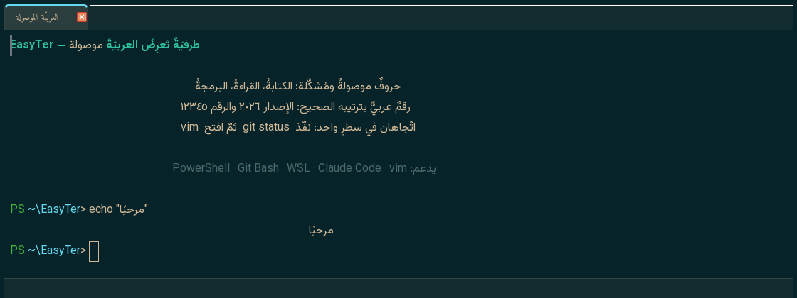
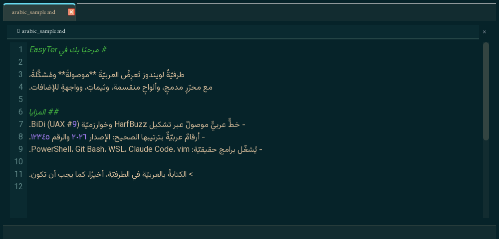

# EasyTer

**طرفيّة ويندوز تعرض العربيّة موصولةً ومرتّبةً بشكل صحيح** — مع تبويبات، وألواح
مقسّمة، وثيمات، وبحث، ومحرّر مدمج، وواجهة إضافات بلغة Python.


[English](README.md)

## لقطات

عربيّةٌ موصولةٌ ومُشكَّلةٌ داخل جلسةِ طرفيّةٍ حقيقيّة — وصلُ الحروف، والتشكيل،
والاتّجاه الثنائيّ، والأرقام العربيّة بترتيبها الصحيح:



والعربيّةُ نفسها صحيحةً في المحرّر المدمج (تلوينٌ نحويّ + أرقام أسطر):



## لماذا

طرفيّات ويندوز الشائعة (Windows Terminal، وطرفيّات الـGPU مثل kitty وAlacritty) **لا
تَصِل** الحروف العربيّة ولا تطبّق خوارزميّة الاتّجاه الثنائيّ، فتظهر العربيّة مقطّعةً
ومعكوسة الترتيب. تَرسم EasyTer كلّ سطر عبر `QTextLayout` في Qt، الذي يدمج تشكيل
HarfBuzz وخوارزميّة BiDi (UAX #9) — المحرّك نفسه الذي تبنيه طرفيّات لينكس يدويّاً.
والنتيجة **عربيّة موصولة** صحيحة، حتّى داخل البرامج التفاعليّة.

مبنيّة على طرفيّة وهميّة حقيقيّة (`pywinpty` / ConPTY) تشغّل محاكي شاشة VT (`pyte`)،
فتشغّل البرامج التفاعليّة الحقيقيّة (PowerShell، cmd، Git Bash، WSL، Claude Code،
vim…).

## المزايا

- **عربيّة موصولة** عبر QTextLayout (تشكيل HarfBuzz + BiDi حسب UAX #9).
- **تبويبات** و**ألواح مقسّمة** (جنباً لجنب / فوق وتحت) بفواصل قابلة للسحب، مع **تكبير
  اللوح**، و**بثّ الإدخال** لكلّ الألواح، و**إعادة فتح آخر تبويب مُغلَق**.
- **التبويب/التقسيم الجديد يفتح في المجلّد الحاليّ** (OSC 7/9;9)، و**عناوين تبويبات
  ديناميّة** تتبع مجلّد العمل.
- **كتل الأوامر** (تكامل OSC 133): شريط جانبيّ أخضر/أحمر لنجاح/فشل كلّ أمر، و`Ctrl+Shift+↑/↓`
  للقفز بين الأوامر.
- **ثيمات** — أكثر من ١٥ مدمجة (Dracula، Nord، Tokyo Night، Gruvbox، Catppuccin، One
  Dark، Monokai، Solarized، Kali Dark…) مع تثويب كامل للواجهة، وتعديل حرّ لألوان ANSI،
  وشفافيّة، و**صورة خلفيّة** اختياريّة.
- **بحث** (`Ctrl+F`) على النصّ المنطقيّ فتُطابَق العربيّة صحيحاً.
- **محرّر مدمج** بتلوين صياغة وأرقام أسطر (يتحمّل الملفّات الكبيرة).
- **روابط قابلة للنقر** (`Ctrl`+نقر)، و**أنماط مؤشّر متعدّدة**، و**حماية لصق** + bracketed
  paste، و**حافظة OSC 52** (البرامج تَنسخ لحافظة النظام).
- **إشعار سطح المكتب** عند انتهاء أمرٍ طويل والنافذة في الخلفيّة.
- **اختصار عامّ (Quake)** `Ctrl+Alt+`​` لاستحضار/إخفاء EasyTer من أيّ مكان.
- **واجهة إضافات Python** — اختصارات، أوامر، ثيمات، خطّافات أحداث، عناصر حالة
  (انظر `examples/init.py`).
- **كشف الصدفات تلقائيّاً** (PowerShell، cmd، Git Bash، WSL)، و**حفظ/استعادة الجلسة**،
  وscrollback قابل للضبط، ورسمٌ سريع مخنوق.
- **وضع كلود** — معالجة BiDi تلقائيّة لواجهة Claude Code ملء الشاشة. يُفعَّل تلقائيّاً
  **فقط حين يكون كلود نفسه قيد التشغيل**، فتبقى البرامج الأخرى التي تستخدم الشاشة البديلة
  (`git diff` عبر `less`، و`vim`، و`man`، و`htop`) على BiDi الأصليّ الصحيح بدل إعادة
  تشكيلها — وهو ما كان يمزّق عربيّتها سابقاً. ويبقى `F2` للتبديل اليدويّ مع أيّ أداة تعكس
  العربيّة مسبقاً.
- واجهة ثنائيّة اللغة: **الإنجليزيّة (افتراضيّة)** والعربيّة. محليّ أوّلاً، **بلا telemetry**.

## المتطلّبات

جديد على أدوات ويندوز البرمجية؟ تحتاج هذين قبل أيّ شيء آخر:

| المتطلّب | رابط التحميل | لماذا |
|---|---|---|
| **ويندوز ١٠ أو ١١** | — (تعتمد EasyTer على ConPTY الخاصّ بويندوز فقط) | لتشغيل EasyTer |
| **Python 3.10–3.14** | [python.org/downloads](https://www.python.org/downloads/) | لتشغيل `install.bat` وEasyTer نفسه |
| **Git** (اختياري) | [git-scm.com/downloads](https://git-scm.com/downloads) | فقط إن استنسخت المستودع بدل تنزيل ZIP |

- في أوّل شاشة لمثبّت Python، **فعِّل خيار "Add python.exe to PATH"** قبل
  الضغط على Install — هذا أشهر سبب لخطأ "python is not recognized". بعد
  التثبيت، **أغلق نافذة الطرفية/PowerShell وافتحها من جديد** ليتم تحديث PATH.
- إن كانت كتابة `python --version` تفتح متجر Microsoft بدل طباعة رقم إصدار،
  فهذا اختصار وهميّ من ويندوز وليس Python حقيقيًّا — ثبّته من الرابط أعلاه
  بدلاً من ذلك (هذا أمر طبيعي على تثبيت ويندوز جديد).
- **حزم Python:** `PySide6` (≥ 6.5)، و`pywinpty` (≥ 3.0.5)، و`pyte`، و`wcwidth`.
  تُثبَّت تلقائيًّا عبر `install.bat` (أو `pip install -r requirements.txt`) —
  لست بحاجة لتثبيتها بنفسك. `pywinpty` 3.0.5 يملك عجلات (wheels) لـ
  Python 3.10–3.14، فلا حاجة لبناءٍ من المصدر.

تفحص EasyTer هذه المتطلّبات عند الإقلاع: إن كان Python قديمًا أو حزمةٌ ناقصة، تعرض
صندوق رسالةٍ يخبرك بالضبط بما عليك تثبيته، بدل أن تفشل بصمت.

## التنزيل

نزّل الملفات المصدرية أولاً، ثمّ تابع مع **التثبيت** أدناه.

> **مهم:** كلتا الطريقتين أدناه تُنشئ مجلّد `EasyTer` بنفسها. نفّذهما من
> مجلّدٍ أبٍ فارغ (مثل `Desktop` أو `Documents` أو `C:\DevSoft`) — لا تُنشئ
> أنت مجلّداً باسم `EasyTer` وتدخل إليه (`cd`) قبل التنزيل، وإلا ستحصل على
> تداخل `EasyTer\EasyTer`، وستفشل أوامر مثل `pip install` أو
> `pythonw EasyTer.py` بخطأ "الملف غير موجود" لأنّك في مستوىً أعلى من
> الكود الفعلي بمجلّد واحد.

- **بدون Git (موصى به لمعظم المستخدمين):** انقر على الزر الأخضر **`<> Code`**
  أعلى هذه الصفحة ثمّ **Download ZIP**، وبعدها انقر بزر الفأرة الأيمن على
  الملف المضغوط واختر **Extract All...** (فكّ الضغط قبل تشغيل أيّ ملف من داخله).
  سينشئ هذا مجلّد `EasyTer` — افتحه قبل المتابعة.
- **باستخدام Git** — ثبّت [Git for Windows](https://git-scm.com/downloads) أوّلاً،
  ثمّ من PowerShell أو Git Bash:
  ```sh
  git clone https://github.com/jaqop/EasyTer.git
  cd EasyTer
  ```
  (أمر `cd EasyTer` ضروري — `git clone` يُنشئ هذا المجلّد، ولا يضع الملفات
  في مجلّدك الحالي.)

## التثبيت

انقر نقراً مزدوجاً على **`install.bat`** داخل مجلّد `EasyTer` الذي فككت ضغطه
أو استنسخته — المجلّد الذي يحتوي `EasyTer.py` مباشرةً، وليس المجلّد الأب له.
يعمل من أيّ مجلّد: يعرض مكان EasyTer،
ويحذّرك إن كان مجلّداً حسّاساً/مؤقّتاً، ويتيح لك التثبيت هنا أو النقل إلى `C:\EasyTer`
(موصى)، ثمّ يثبّت التبعيّات. أو يدويّاً من مجلّد المشروع:

```sh
cd path\to\EasyTer
pip install -r requirements.txt
```

## التشغيل

```sh
pythonw EasyTer.py
```

أو انقر نقراً مزدوجاً على `EasyTer.vbs` (بلا نافذة كونسول)، أو شغّل `run.bat`.

إن لم يحدث شيء عند تشغيل هذا الأمر (`pythonw` لا يظهر كونسول، فالأخطاء تكون
صامتة)، شغّل `python EasyTer.py` بدلاً منه — `python` وحدها تُبقي النافذة
مفتوحة وتطبع الخطأ الفعلي، وغالباً ما يكون إمّا مجلّداً خاطئاً (راجع
**التنزيل** أعلاه) أو حزماً ناقصة (راجع **التثبيت** أعلاه).

## اللغة

الواجهة إنجليزيّة افتراضيّاً. للتحويل إلى العربيّة: **الإعدادات (`Ctrl+,`) ← اللغة ←
العربية**، ثمّ أعد تشغيل EasyTer.

## اختصارات لوحة المفاتيح

| المفاتيح | الإجراء |
|------|--------|
| `Ctrl+T` · `+` | تبويب جديد |
| `Ctrl+Shift+T` | إعادة فتح آخر تبويب مُغلَق |
| `Ctrl+Tab` / `Ctrl+Shift+Tab` | التبويب التالي / السابق |
| `Ctrl+Shift+E` / `Ctrl+Shift+O` | تقسيم جنباً لجنب / فوق وتحت |
| `Ctrl+Shift+N` | فتح محرّر جنب الطرفيّة |
| `Ctrl+Shift+W` | إغلاق اللوح (الأخير يغلق التبويب) |
| `Ctrl+Shift+Z` | تكبير / استعادة اللوح النشط |
| `Ctrl+Shift+B` | بثّ الكتابة لكلّ الألواح |
| `Alt + الأسهم` | التنقّل بين الألواح |
| `Ctrl+Shift+↑` / `Ctrl+Shift+↓` | القفز للأمر السابق / التالي |
| `Ctrl+Shift+Space` | وضع النسخ (تحديد السجلّ بلوحة المفاتيح) |
| `Ctrl` + نقر | فتح رابط |
| `Ctrl+C` / `Ctrl+V` | نسخ التحديد (وإلّا مقاطعة) / لصق |
| `Ctrl+Shift+C` / `Ctrl+Shift+V` | نسخ / لصق (دائمًا) |
| `Ctrl+F` | بحث |
| `F2` | وضع كلود (BiDi) — يدويّ/تلقائيّ |
| `Ctrl++` / `Ctrl+-` / `Ctrl+0` | تكبير / تصغير / إعادة حجم الخطّ |
| `Ctrl+,` · ⚙ | الإعدادات |
| `Ctrl+Shift+P` | لوحة الأوامر (أوامر الإضافات) |
| `Ctrl+Shift+M` | معرض المظاهر (تصفّح الثيمات) |
| `Ctrl+Shift+G` | معرض شكل الموجّه (oh-my-posh، معاينات حيّة) |
| `Ctrl+Alt+`​` | استحضار / إخفاء EasyTer (عامّ، من أيّ مكان) |
| `F1` · `?` | كلّ الاختصارات |

## الإضافات

ضع ملفّ `~/.easyter/init.py` لإضافة اختصاراتك وأوامرك وثيماتك وخطّافات الأحداث
وعناصر الحالة. نموذجٌ موثَّق في [`examples/init.py`](examples/init.py).

## الخطوط والترخيص

كود التطبيق مرخَّص بـ**MIT** (© 2026 jaqop، انظر [LICENSE](LICENSE)). أمّا الخطوط
العربيّة المضمومة في `fonts/` (Amiri، Vazirmatn، Noto Naskh Arabic) فبترخيص **SIL
Open Font License 1.1** (انظر [fonts/OFL.txt](fonts/OFL.txt)). لاستعمال خطٍّ عربيّ
آخر، ضع ملفّ `.ttf` في `fonts/` وعدّل قائمة الخطوط.

بُنِيت بـPython + PySide6 + pyte + pywinpty (ConPTY).
